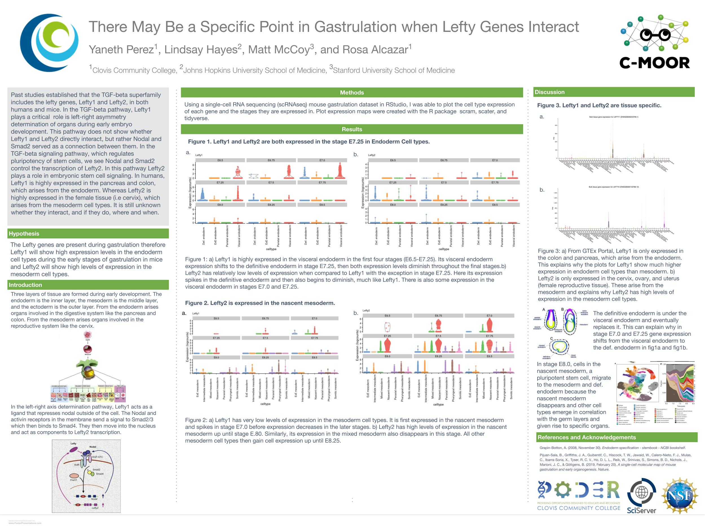

+++
author = "Yaneth Perez"
title = "Genomics Research Project"
date = "2022-05-17"
description = "A post announcing and linking to an R Notebook"
tags = [
    "R"
]
+++

Check out this [awesome R Notebook](RNotebook_demo.nb.html) and poster I made! 

It looks at the inteaction between the Lefty genes in mouse gastrulation, specifically what stages and celltypes.

